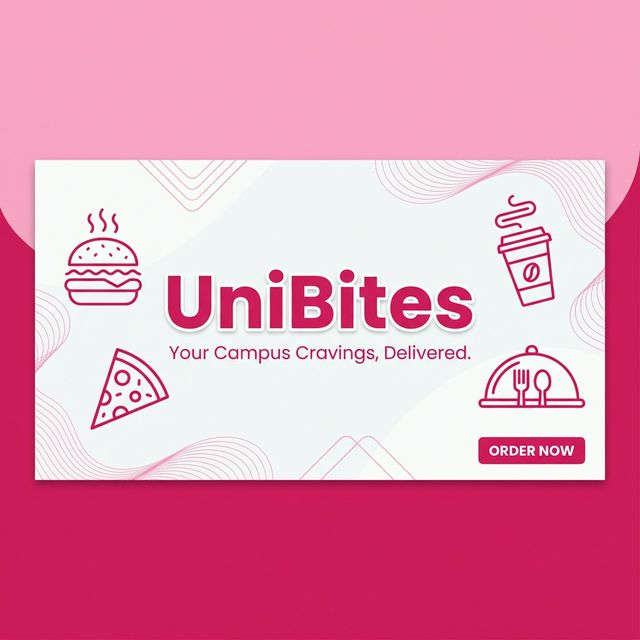

# 🍔 UniBites

<p align="center">
  
</p>

[](https://flutter.dev)
[](https://firebase.google.com)
[](https://www.mongodb.com/atlas)

> **Skip the queue, grab the bite.** UniBites is a premium, campus-exclusive food ordering platform designed to eliminate waiting times and streamline the dining experience for university students and staff using a modern, reactive tech stack.

---

## 🏗️ Architecture & Technical Design

UniBites follows a clean, decoupled **Service-Provider-Model** architecture, ensuring scalability and ease of testing.

### 1. Data Layer (Models)
Uses `json_serializable` for robust data mapping. Core entities include:
- **`User`**: Profiles, dietary preferences, and auth metadata.
- **`Outlet`**: Campus location data, operating hours, and live status.
- **`MenuItem`**: Categories, dietary tags (Veg/Non-Veg), and pricing.
- **`Order`**: Integrated status history tracking and estimated pickup windows.

### 2. Logic Layer (Services)
- **`DatabaseService`**: Manages the persistent MongoDB connection with optimized retry logic and socket handling.
- **`AuthService`**: Bridges Firebase Auth (Email & Google) with the application state.
- **`OrderService`**: Handles the transaction lifecycle and status history appending.
- **`CartService`**: Manages the volatile cart state with persistence during app restarts.

### 3. State Management (Riverpod)
Leverages **Riverpod 2.0** with code generation:
- **Reactive Polling**: `StreamProvider` is used for order tracking, polling the backend every 3 seconds for status changes (`Confirmed` ➔ `Preparing` ➔ `Ready`).
- **Async Handling**: Comprehensive use of `AsyncValue` to handle loading, error, and data states globally.
- **Family Providers**: Efficiently tracks individual orders by ID without redundant network calls.

---

## ✨ Key System Workflows

### 🛒 The "Guest-to-User" Cart Migration
One of UniBites' flagship features is the frictionless shopping experience. 
1. A guest adds items to their cart (stored in `shared_preferences`).
2. Upon login/signup, the system automatically detects the guest cart.
3. The `CartService` merges these items into the authenticated user's account, ensuring no progress is lost.

### 📊 Real-Time Order Lifecycle
Orders aren't just static records; they are living objects.
- **Lifecycle**: `Pending` ➔ `Confirmed` ➔ `Preparing` ➔ `Ready for Pickup` ➔ `Fulfilled`.
- **Status History**: Every transition is timestamped and recorded in the `statusHistory` array within MongoDB, providing users with a transparent audit trail of their food preparation.

---

<p align="center">
  
</p>

---

## 🛠️ Tech Stack & Infrastructure

- **Frontend:** [Flutter](https://flutter.dev) (Material 3)
- **State Management:** [Riverpod](https://riverpod.dev) + [Riverpod Generator](https://pub.dev/packages/riverpod_generator)
- **Database:** [MongoDB Atlas](https://www.mongodb.com/atlas) (Cloud NoSQL)
- **Auth:** [Firebase Authentication](https://firebase.google.com/docs/auth)
- **Routing:** [GoRouter](https://pub.dev/packages/go_router) for declarative navigation.
- **UI UX:** [Google Fonts (Poppins)](https://fonts.google.com/specimen/Poppins) & [Shimmer Effects](https://pub.dev/packages/shimmer).

---

## 📂 Project Structure

```text
lib/
├── config/             # Theme tokens (Pink #D81B60) & GoRouter definitions
├── models/             # G-classes for JSON serialization
├── providers/          # Riverpod UI-state logic & Polling implementations
├── screens/            # Fully implementation-ready UI (not just wireframes)
├── services/           # The "Source of Truth" (Direct API/DB interactions)
└── widgets/            # Atomized UI components (Pills, Cards, Sheets)
```

---

## 🚀 Environment Setup

### 1. Database Configuration
Update the MongoDB connection string in `lib/services/database_service.dart`.
> **Note:** The current implementation includes automated reconnection logic for MongoDB socket closures.

### 2. Firebase Integration
- Place `google-services.json` in `android/app/`.
- Ensure Google Sign-In is enabled in the Firebase Console.

### 3. Build Runner
UniBites relies on code generation for models and providers.
```bash
# One-time build
flutter pub run build_runner build --delete-conflicting-outputs

# Continuous watch mode
flutter pub run build_runner watch
```

---

## 🎨 Branding & Design
- **Primary Color:** `#D81B60` (Vibrant Pink)
- **Typography:** Poppins (Regular, Medium, Semi-Bold)
- **Design Philosophy:** Premium, clean, and whitespace-heavy for reduced cognitive load during busy campus hours.

---

## 📱 App Showcase

<p align="center">
  
</p>

---

## 🤝 Contributing

Contributions are what make the open-source community such an amazing place to learn, inspire, and create. Any contributions you make are **greatly appreciated**.

1. Fork the Project
2. Create your Feature Branch (`git checkout -b feature/AmazingFeature`)
3. Commit your Changes (`git commit -m 'Add some AmazingFeature'`)
4. Push to the Branch (`git push origin feature/AmazingFeature`)
5. Open a Pull Request

---

## 📄 License

Distributed under the MIT License. See `LICENSE` for more information.

---

**Developed with ❤️ by [iteshxt](https://github.com/iteshxt).**

